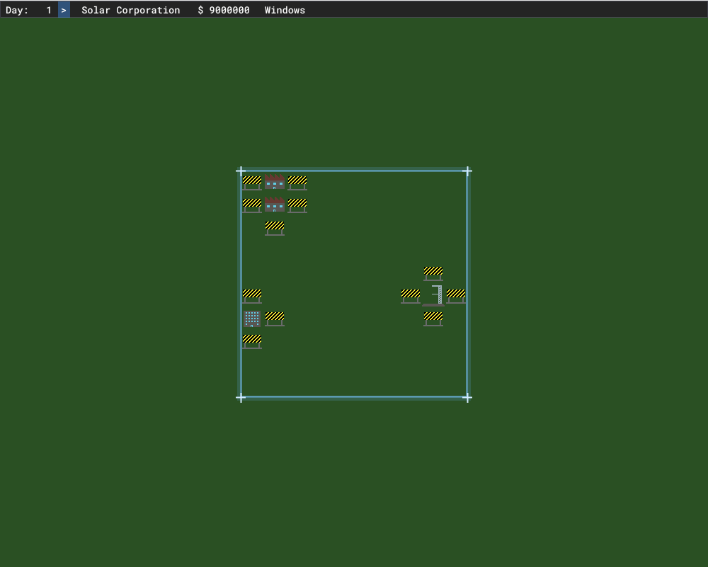

# Sol, Corp.

Ever wanted to run your own Corporation exploring and exploiting the entire Solar System? Would you like a deep simulation rather than an arcade version? 

Welcome to Sol, Corp.

## Introduction

Sol, Corp. is a 4X, strategic, realistic simulator of building a company to explore the solar system. You build rockets, launch payloads, build stations and bases, capture asteroids, exploit their resources and dominate the solar system.

## Features

- Build rockets and launch payloads to orbit
- Accept contracts for satellite launches
- Survive rocket failures
- Explore the main bodies of the solar system
- Mod the game with Lua scripts

## Current Status

The game is still very much in early alpha, but the first playable version has been [released](https://github.com/pkuehne/solcorp/releases) for both Windows and Linux.

The core game play loop is implemented, along with a main menu, basic rocket construction and launch mechanics, and a simple contract system. The game is fully moddable with Lua scripts.

See the [documentation](https://pkuehne.github.io/solcorp/#/gameplay/README) for a guide on how to play.

## Development

The current and future milestones are tracked in the [GitHub Milestones](https://github.com/pkuehne/solcorp/milestones) and the [Project Board](https://github.com/pkuehne/solcorp/projects).

Key upcoming features include:
- More detailed rocket construction with parts and stats
- A full staff system with hiring, salaries, and morale
- More complex contracts
- Celestial mechanics and orbital simulation
- Construction of stations and bases
- Resource extraction and management
- Improved UI and graphics

The end goal is to have a deep, complex simulation of running a space corporation, with a focus on realism and strategic decision making.

## Modding

The game is designed to be fully moddable with Lua scripts. You can add new rockets, contracts, celestial bodies, and more by writing Lua code that interacts with the C++ game engine. More information on modding can be found in the [modding documentation](https://pkuehne.github.io/solcorp/#/modding/README).

## Contributing

Contributions are welcome, but please open an issue first to discuss what you would like to work on. See the [contributing guidelines](CONTRIBUTING.md) for more details.