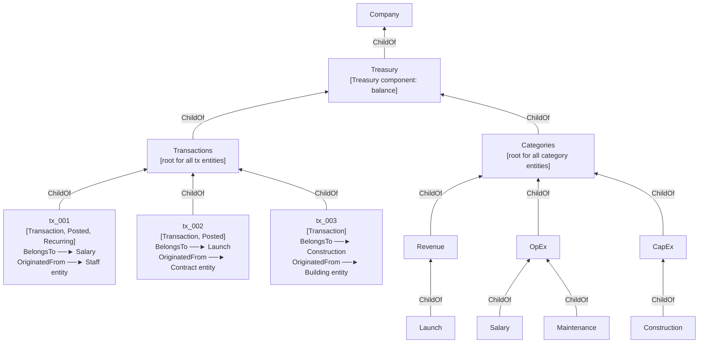

# Finance System

> Implementation design for the transaction-as-entity finance model. See [ADR 003](../adr/003-finance-system.md) for the decision rationale.

---

## Entity Hierarchy

All financial state lives under a single `Company` entity. `Treasury` is itself an entity (not just a component) carrying the `Treasury` component. `Transactions` and `Categories` are well-known child entities of `Treasury`, providing stable roots for queries and a clean namespace in the Flecs REST inspector.



---

## Structure

### Company entity and Treasury

`Treasury` is a named entity under `Company`, carrying the `Treasury` component with the cached posted balance.

```cpp
struct Treasury {
  double balance = 0.0; // running total of posted transactions only
};

// Created by FinanceModule:
auto company  = world.entity("Company");
auto treasury = world.entity("Treasury").child_of(company).set<Treasury>({});
auto tx_root  = world.entity("Transactions").child_of(treasury);
auto cat_root = world.entity("Categories").child_of(treasury);
```

### Transaction component and tags

```cpp
struct Transaction {
  double      amount;       // positive = income, negative = expense
  std::string description;
  uint32_t    created_day;  // game day the transaction was created
  uint32_t    post_day;     // game day it becomes effective (= created_day for immediate)
};

struct Posted    {};  // applied once the transaction is reflected in Treasury.balance
struct Recurring {};  // marks transactions that originate from a repeating schedule
struct Failed    {};  // future-dated debit that could not post due to insufficient funds
```

Transactions are Flecs entities `ChildOf(tx_root)`. A system in `UpdatePhase` adds `Posted` and updates `Treasury.balance` when `post_day <= current_game_day`.

### Categorisation

Categories are named entities `ChildOf(cat_root)`, forming a two-level hierarchy (top-level group → specific type). Seeded by `FinanceModule` and extensible from Lua mods.

```
Categories
├── Revenue
│   └── Launch
├── OpEx
│   ├── Salary
│   └── Maintenance
└── CapEx
    ├── Construction
    └── Permit
```

Each transaction links to a category via the `BelongsTo` relationship:

```cpp
struct BelongsTo {};  // relationship: transaction → category entity

flecs::entity salary_cat = world.entity("Company::Treasury::Categories::OpEx::Salary");
tx_entity.add<BelongsTo>(salary_cat);
```

Querying all salary transactions:
```cpp
flecs::entity salary_cat = world.entity("Company::Treasury::Categories::OpEx::Salary");
world.query<Transaction>().with<BelongsTo>(salary_cat).build();
```

### Source linking

Each transaction optionally links back to the ECS entity that originated it (contract, building, staff team, etc.) via the `OriginatedFrom` relationship:

```cpp
struct OriginatedFrom {};  // relationship: transaction → source entity

tx_entity.add<OriginatedFrom>(contract_entity);
```

This enables "show me all spend on Building X" or "show me all revenue from Contract Y" as plain Flecs queries without any extra bookkeeping.

### Recurring / one-off

The `Recurring` tag marks transactions created by a repeating schedule (monthly salaries, building maintenance). One-off transactions (construction cost, permit fee) carry no tag. A scheduling system creates the next `Recurring` transaction entity when the previous one posts.

### Action pattern

Financial mutations go through the action interface (see ADR 004):

```cpp
struct TransactAction : IAction {
  double      amount;          // positive = income, negative = expense
  std::string description;
  uint32_t    post_day = 0;    // 0 = current game day (immediate)
  flecs::entity category;      // BelongsTo target
  flecs::entity origin;        // OriginatedFrom target (optional, may be null)
  bool          recurring = false;

  ValidationResult validate(const flecs::world& world) const override;
  // For immediate debits: checks Treasury.balance + amount >= 0.
  // For future-dated debits: checks projected balance
  // (Treasury.balance + sum of all non-Failed pending transactions + amount >= 0).

  void execute(flecs::world& world) override;
  // Creates a Transaction entity ChildOf(tx_root) with BelongsTo(category),
  // optionally OriginatedFrom(origin), and Recurring tag if set.
  // If post_day <= current_game_day, adds Posted and updates Treasury.balance immediately.
};
```

Callers check `validate()` before showing confirmation UI or scheduling the action. The posting system also validates at post time; if the balance has fallen since scheduling, the transaction receives `Failed` rather than silently overdrafting.

### Contract integration

The existing `Contract` component's `upfront_payment` and `completion_payment` floats are unchanged — they are data, not behaviour. The rocket launch module calls `TransactAction` at the appropriate moments:

- Upfront payment: immediate `TransactAction` with `category = launch_cat` and `origin = contract_entity`, called when status moves to `Accepted`.
- Completion payment: future-dated `TransactAction` with the same category and origin, created at acceptance so it appears in cashflow projections before the launch occurs.

---

## Extensibility

The following are not implemented now but are supported by this model without structural changes:

- **Cashflow projection** — query all `Transaction` entities lacking `Posted` (and not `Failed`) within a date range; sum against current balance.
- **Money market / investments** — a new action type creates a pair of transactions: an immediate debit (a new `CapEx` leaf category) and a future-dated credit (a new `Revenue` leaf category), both with the same `OriginatedFrom` origin entity.
- **Multiple companies** — `Treasury`, `Transactions`, and `Categories` are all `ChildOf` a specific `Company` entity; a second company gets its own subtree and its own `Treasury` component instance.
- **Save-game verification** — recompute `Treasury.balance` by summing all `Posted` transactions and assert it matches the cached value.
- **New categories from mods** — Lua calls `world.entity("MyNewCost").child_of(world.entity("Company::Treasury::Categories::OpEx"))` to register a new leaf category; no C++ changes required.
