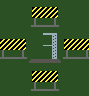
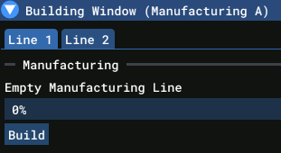

# Building

A **Building** is a structure on your [site](gameplay/concepts/site.md) that contains one or more facilities. Each building is of a particular type (e.g. "Launch Complex", "Office Building", "Factory") and provides specific capabilities through its facilities.

Buildings contain one or more **Facilities** that provide specific capabilities. Thus a building can have several launchpads, to launch more than one rocket at a time, or a combination of offices and storage. 

Clicking on a building opens the building view, which shows the facilities contained within and allows you to manage operations related to those facilities.

Each building is surrounded by construction markers that indicate where new buildings may be placed. You can only build on tiles that have construction markers. When you place a building, construction markers will be added to adjacent tiles, allowing you to expand your site outwards. 

## Facilities

At present, there are four types of facility:

| Facility | Purpose |
|----------|---------|
| Launchpad | Required to execute a rocket launch |
| Office | Provides administrative capacity (not implemented) |
| Storage | Stores manufactured rockets |
| Manufacturing | Produces rockets |

