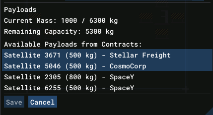

# Contract

**Contracts** are offered by client companies and describe a mission to be performed. Contracts are generated periodically. Once accepted, the contract is added to your active contracts and the payloads become available to be scheduled onto a launch.

Each contract specifies:
- A client company (e.g. *Acme Corp*)
- A description of the mission
- A payment split into an upfront amount (paid on acceptance) and a completion amount (paid on successful delivery)
- A target orbit the payload must reach

## Payloads

Each contract comes with one or more payloads. Each payload specifies:

- A name (e.g. *Satellite 4231*)
- A mass (kg)
- A target orbit (e.g. `Low Orbit`)

Payloads are attached to a [launch plan](gameplay/concepts/launch-plan.md). The total mass of all loaded payloads must be within the rocket's capacity for the target orbit.

## Managing Contracts

Use the [Contract List](gameplay/windows/contract-list.md) window to browse available and active contracts, and the [Contract Detail](gameplay/windows/contract-detail.md) window to review terms and accept or reject a contract.
