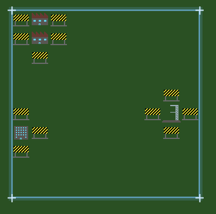

# Site

A **Site** is your "base". This is where you will house staff, construct rockets and launch them for money. It is represented as a grid of buildable tiles. Each tile can contain one building, and each building contains one or more facilities that provide capabilities (e.g. launchpads, offices, storage).

Sites are limited in size and the extent of the site is shown with a blue border. You can only build within the site boundary, but you can place buildings adjacent to the boundary.
