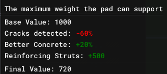

# Core Concepts

## Overview

This section covers the core concepts of SolCorp's gameplay, simulation, company and balance and the windows for managing various aspects.

## Simulation

The game operates on a day-based simulation. Each day, the game processes events such as rocket manufacturing, contract deadlines, and launch operations. Days can be advanced by clicking the play/pause button on the main toolbar. When the game is paused, you can still manage your site and prepare for upcoming launches, but but most actions won't complete until you click play again and at least one day has passed.

## Company

In Solcorp, your main focus is the day-to-day running of a space exploration company. While the game revolves around launching rockets (and later exploiting resources in the solar system) the main focus is building your company. This includes adding new capabilities ([Rockets](gameplay/concepts/rocket.md), [Buildings](gameplay/concepts/building.md), etc) as well as (later) managing your share price. At this time, aim for the highest balance possible by effectively managing your [Contracts](gameplay/concepts/contract.md), buildings and [Launch Plans](gameplay/concepts/launch-plan.md).

## Sites

A [Site](gameplay/concepts/site.md) is your base of operations. It contains buildings, which allow you to manage various aspects of your operation. It includes [Buildings](gameplay/concepts/building.md) to construct and store rockets, house your staff and launchpads for sending rockets into space.

## Contracts

[Contracts](gameplay/concepts/contract.md) are (initially) your main income source. They will provide a small up-front influx of cash to allow you to build rockets. They also provide a payload, which must be delivered to the correct orbit. One there, a final payment is sent over. 

## Stats, Effects & Modifiers

**Stats** are named numerical values that represent a particular aspect of a site, building, or facility (e.g. "Max Weight", "Prep Days", "Launch Failure Rate"). Stats can be modified by **effects**. Hovering over a stat in the UI will show the base value and any active modifiers as well as the final modified value.

**Effects** are named conditions attached to a site or building (e.g. "Better Concrete", "Cracks Detected"). Each effect carries one or more **modifiers** that adjust a named statistic multiplicatively or additively.

