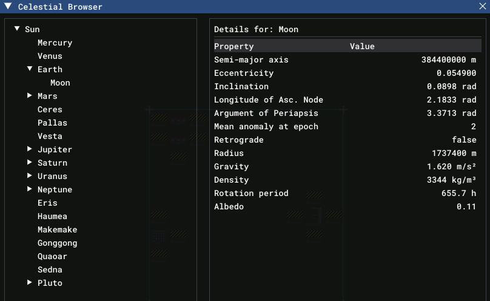

# Simulation

## Celestial Bodies

The simulation models a hierarchical system of celestial bodies. In the core game, this is our solar system, but the architecture supports arbitrary systems for future expansion.

Each body has core orbital parameters:
- Semi-major axis
- Eccentricity
- Inclination
- Longitude of ascending node
- Argument of periapsis
- Mean anomaly at epoch
- Retrograge indicator

The body's physical parameters include:
- Radius
- Surface gravity
- Density
- Mass
- Gravitational parameter (GM)
- Rotation period
- Albedo

The details for all bodies, can be seen in the Celestial Browser via the Windows menu in the toolbar.

## Orbital Mechanics

Orbital calculations have not yet been implemented, but the plan is to use a patched conic approximation for launch and transfer calculations. This will allow us to model multi-body systems without the complexity of n-body simulations. The simulation will calculate orbital parameters for rockets and payloads, allowing for accurate contract requirements and launch planning.
