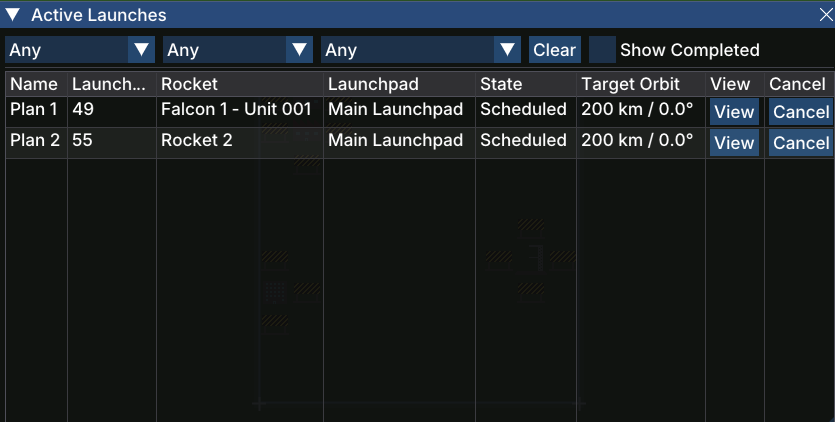

# Active Launches

The **Active Launches** window is a live dashboard of every [launch plan](gameplay/concepts/launch-plan.md) your company has scheduled or currently in progress. Use it to monitor upcoming launches, track their stage, and cancel plans that are no longer needed.

## Opening the Window

Open Active Launches from the **Active Launches** button in the [toolbar](gameplay/windows/main-toolbar.md).

## Columns

| Column | Description |
|--------|-------------|
| **Name** | The launch plan name (e.g. *Plan 1*) |
| **Launch Day** | The in-game day on which the rocket is scheduled to launch |
| **Rocket** | The [rocket](gameplay/concepts/rocket.md) assigned to this plan |
| **Launchpad** | The pad from which the rocket will launch |
| **State** | The current stage of the launch plan (see below) |
| **Target Orbit** | The orbit the rocket is aiming for, shown as altitude and inclination (e.g. *200 km / 0.0°*) |
| **View** | Opens the [Launch Plan](gameplay/windows/launch-plan.md) window for that plan |
| **Cancel** | Cancels the launch plan and returns the rocket to its previous state |

## States

| State | Meaning |
|-------|---------|
| **Scheduled** | The plan has been saved and is waiting for the move/rollout sequence to begin |
| **Moving** | The rocket is being transported to the launchpad |
| **Rollout** | The rocket is at the pad and being prepared for launch |
| **Pad Prep** | Final pre-launch checks are underway |
| **Launched** | The rocket has lifted off |
| **Completed** | The mission concluded successfully |
| **Failed** | The rocket was lost during launch |

## Filters

Three independent drop-downs at the top of the window let you narrow the list by rocket, launchpad, or state. Click **Clear** to reset all filters at once.

- **Show Completed** toggle — when enabled, completed and failed plans are included in the list so you can review past launches.
