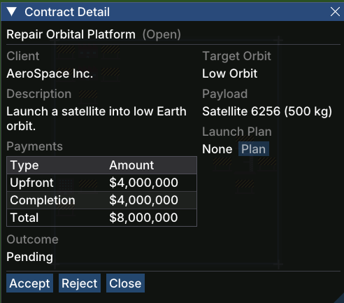

# Contract Detail

The **Contract Detail** window shows the full information for a single [contract](gameplay/concepts/contract.md) and lets you accept or reject it.

## Opening the Window

Click **View** on any row in the [Contract List](gameplay/windows/contract-list.md).

## Sections

### Header

Displays the contract name and its current state in parentheses (e.g. *Repair Orbital Platform (Open)*).

### Client

The company that issued this contract (e.g. *AeroSpace Inc.*).

### Description

A short mission brief describing what needs to be delivered and why (e.g. *Launch a satellite into low Earth orbit*).

### Payments

A breakdown of the financial terms:

| Type | Description |
|------|-------------|
| **Upfront** | Paid immediately when you accept the contract |
| **Completion** | Paid when the payload is successfully delivered to the target orbit |
| **Total** | Combined value of upfront and completion payments |

### Target Orbit

The orbit the payload must reach. This must match the target orbit configured in the [Launch Plan](gameplay/windows/launch-plan.md) and must be within the chosen rocket's lift capacity.

### Payload

The name and mass of the payload to be delivered (e.g. *Satellite 6256 (500 kg)*). The payload mass must be within the rocket's capacity for the target orbit. See [Contract](gameplay/concepts/contract.md) for full payload details.

### Launch Plan

Shows which [launch plan](gameplay/concepts/launch-plan.md) this contract's payload is currently assigned to, or *None* if it is unscheduled. The **Plan** button opens the [Launch Plan](gameplay/windows/launch-plan.md) window so you can schedule a launch for this contract.

### Outcome

The result once the contract has been resolved — *Pending* while the launch is in progress, *Success* on delivery, or *Failed* if the rocket was lost.

## Actions

| Button | Action |
|--------|--------|
| **Accept** | Accept the contract, receive the upfront payment, and make the payload available for scheduling |
| **Reject** | Decline the contract; it will be removed from your list |
| **Close** | Close the window without taking action |
