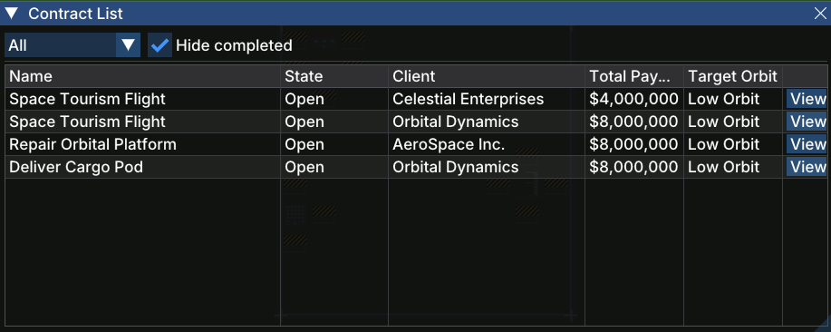

# Contract List

The **Contract List** window shows all [contracts](gameplay/concepts/contract.md) that have been offered to your company, along with their client, payout, and target orbit.

## Opening the Window

Open the Contract List from the **Contracts** button in the [toolbar](gameplay/windows/main-toolbar.md).

## Columns

| Column | Description |
|--------|-------------|
| **Name** | The mission name (e.g. *Repair Orbital Platform*) |
| **State** | The contract's current state (see below) |
| **Client** | The company that issued the contract |
| **Total Pay** | The total reward paid on successful completion |
| **Target Orbit** | The orbit the payload must reach |
| **View** | Opens the [Contract Detail](gameplay/windows/contract-detail.md) window for that contract |

## States

| State | Meaning |
|-------|---------|
| **Open** | The contract is available to accept or reject |
| **Active** | The contract has been accepted and is in progress |
| **Completed** | All payloads were delivered and the final payment was received |
| **Failed** | The launch failed and the contract could not be fulfilled |

## Filters

- **Status filter** (drop-down, default *All*) — narrows the list to contracts in a particular state.
- **Hide completed** (checkbox, on by default) — removes completed and failed contracts so the list stays focused on actionable work.
