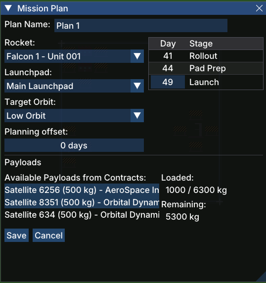

# Launch Plan (Mission Plan)

The **Launch Plan** window (titled *Mission Plan* in-game) is where you configure everything needed to execute a rocket launch: the rocket, launchpad, target orbit, and the payloads to be carried. Once saved, the plan appears in [Active Launches](gameplay/windows/active-launches.md) and the launch sequence begins automatically.

## Opening the Window

The Launch Plan window can be opened from several places:

- The **Launch Planner** button in the [toolbar](gameplay/windows/main-toolbar.md)
- The **Schedule** button in the [Rocket Detail](gameplay/windows/rocket-detail.md) window
- The **Plan** button in the [Contract Detail](gameplay/windows/contract-detail.md) window
- The **View** button on any row in the [Active Launches](gameplay/windows/active-launches.md) window

## Configuration Fields

| Field | Description |
|-------|-------------|
| **Plan Name** | A free-text name for this launch plan (e.g. *Plan 1*) |
| **Rocket** | Drop-down to select a [rocket](gameplay/concepts/rocket.md). Only rockets that are not already assigned to another plan are listed |
| **Launchpad** | Drop-down to select the launchpad from which to launch |
| **Target Orbit** | Drop-down to select the destination orbit. Must be compatible with the rocket's lift capacity |
| **Planning offset** | Number of days added to the automatically calculated launch date, letting you delay a launch if needed |

## Stage Timeline

The panel on the right side of the window shows the automatically calculated schedule for this launch, broken down by stage and in-game day:

| Stage | Description |
|-------|-------------|
| **Rollout** | The rocket is moved from storage to the launchpad |
| **Pad Prep** | The rocket is fuelled and undergoes final checks at the pad |
| **Launch** | The rocket lifts off on this day |

The launch day is derived from the current in-game date plus the time required for each stage (based on the rocket's Move Duration and Rollout Duration stats) plus any planning offset.

## Payloads

The lower section manages the payloads for this launch:

- **Available Payloads from Contracts** — lists payloads from accepted [contracts](gameplay/concepts/contract.md) that have not yet been assigned to a launch. Click a payload to add it to this plan.
- **Loaded** — the total mass already loaded onto the rocket versus its maximum capacity for the chosen orbit (e.g. *1000 / 6300 kg*).
- **Remaining** — how much additional payload capacity is still available (e.g. *5300 kg*).

The plan cannot be saved if the loaded mass exceeds the rocket's capacity for the target orbit.

## Saving and Validation

The **Save** button commits the plan and adds it to the [Active Launches](gameplay/windows/active-launches.md) list. If any required fields are missing or the payload mass exceeds capacity, the button will be disabled and a message will indicate what needs to be fixed.

**Cancel** closes the window without saving any changes.
