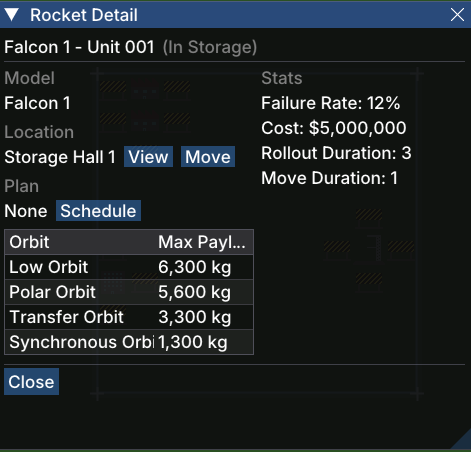

# Rocket Detail

The **Rocket Detail** window shows the full profile of a single [rocket](gameplay/concepts/rocket.md) — its model, current location, stats, lift capacities, and any scheduled [launch plan](gameplay/concepts/launch-plan.md).

## Opening the Window

Click **View** on any row in the [Rocket List](gameplay/windows/rocket-list.md), or click **View** next to a rocket name anywhere else in the UI (e.g. from the [Launch Plan](gameplay/windows/launch-plan.md) window).

## Sections

### Header

Displays the rocket's full name and its current state in parentheses (e.g. *Falcon 1 – Unit 001 (In Storage)*).

### Model

The rocket model (prefab) this unit was built from (e.g. *Falcon 1*). The model determines the rocket's base stats and lift capacities.

### Location

Where the rocket currently is. The **View** button opens the building detail for that location. The **Move** button lets you schedule a manual move to another building or pad.

### Plan

Shows which [launch plan](gameplay/concepts/launch-plan.md) this rocket is assigned to, or *None* if it is unscheduled. The **Schedule** button opens the [Launch Plan](gameplay/windows/launch-plan.md) window pre-populated with this rocket so you can create a new plan.

### Stats

Key performance figures for this rocket unit:

| Stat | Description |
|------|-------------|
| **Failure Rate** | Probability the launch fails (lower is better) |
| **Cost** | Manufacturing cost of this unit |
| **Rollout Duration** | Days needed to roll the rocket out to the launchpad |
| **Move Duration** | Days needed to move the rocket between buildings |

### Payload Capacity Table

Lists the maximum payload mass (kg) this rocket can deliver to each orbit type. Heavier or more distant orbits have lower capacity.

| Orbit | Max Payload |
|-------|-------------|
| Low Orbit | highest capacity |
| Polar Orbit | slightly reduced |
| Transfer Orbit | further reduced |
| Synchronous Orbit | lowest capacity |

See [Rocket](gameplay/concepts/rocket.md) for an explanation of how lift capacity works.

## Actions

- **Close** — closes the window.
