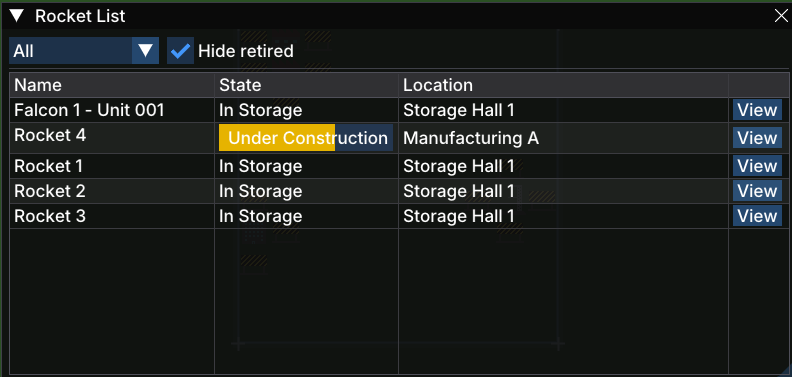

# Rocket List

The **Rocket List** window shows every [rocket](gameplay/concepts/rocket.md) your company owns, along with its current state and location.

## Opening the Window

Open the Rocket List from the **Rockets** button in the [toolbar](gameplay/windows/main-toolbar.md).

## Columns

| Column | Description |
|--------|-------------|
| **Name** | The rocket's name, combining its model and unit number (e.g. *Falcon 1 – Unit 001*) |
| **State** | The rocket's current state (see below) |
| **Location** | The building or pad where the rocket currently is |
| **View** | Opens the [Rocket Detail](gameplay/windows/rocket-detail.md) window for that rocket |

## State Badges

| State | Colour | Meaning |
|-------|--------|---------|
| **In Storage** | — | The rocket is sitting in a storage building, ready to be scheduled |
| **Under Construction** | Yellow | The rocket is still being built on a manufacturing line |
| **On Pad** | — | The rocket has been moved to a launchpad |
| **Launched** | — | The rocket has been launched and is in flight |

## Filters

- **Status filter** (drop-down, default *All*) — narrows the list to rockets in a particular state.
- **Hide retired** (checkbox, on by default) — removes retired rockets from the list so you can focus on active inventory.
